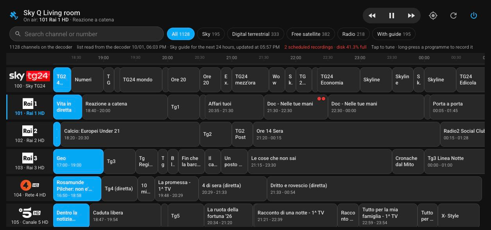
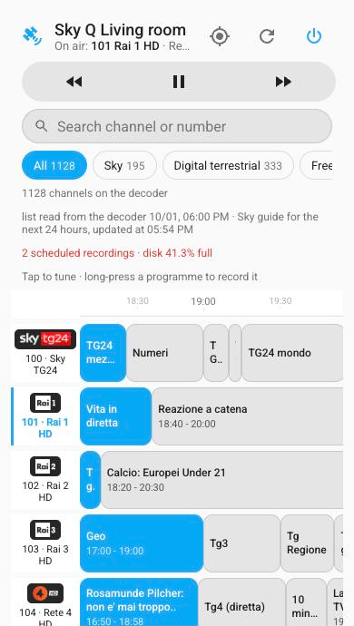
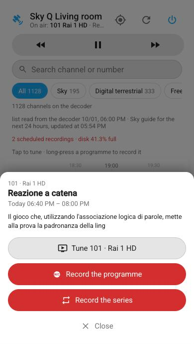
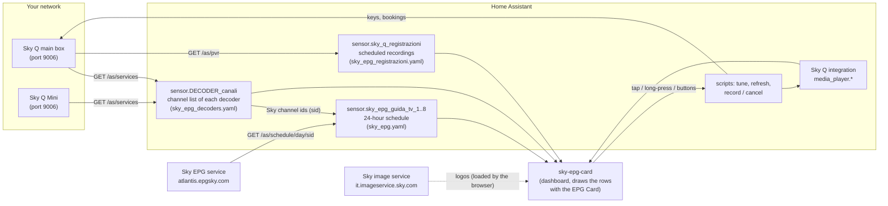

# Sky Q TV Guide for Home Assistant

[](https://hacs.xyz/docs/faq/custom_repositories)
[](https://www.home-assistant.io/)
[](LICENSE)

A complete, fast **TV guide for Sky Q decoders (Sky Italia)** inside Home Assistant:
the guide shows **exactly the channels that are on each decoder** (satellite, Sky,
digital terrestrial 5000+ and free channels), with the **official Sky schedule of the
next 24 hours**. Tap a channel to tune the decoder, long-press a programme to
**record it or the whole series**, and use the **rewind / play-pause / fast-forward**
buttons to control playback.

Everything runs **inside Home Assistant**: no add-ons, no Docker containers, no
external servers. It is made of a few YAML packages, one Jinja macro file and a
Lovelace card.

<p align="center">
  
</p>
<p align="center">
  
  &nbsp;
  
</p>

---

## Contents

- [Features](#features)
- [How it works](#how-it-works)
- [Requirements](#requirements)
- [Installation](#installation)
  - [1. Sky Q integration](#1-sky-q-integration)
  - [2. EPG Card](#2-epg-card)
  - [3. Backend (packages and macros)](#3-backend-packages-and-macros)
  - [4. The card](#4-the-card)
  - [5. The dashboard](#5-the-dashboard)
- [Configuration](#configuration)
  - [Decoders (`sky_epg_decoders.yaml`)](#decoders-sky_epg_decodersyaml)
  - [Card options](#card-options)
- [Using the guide](#using-the-guide)
- [Entities, scripts and events](#entities-scripts-and-events)
- [Updating](#updating)
- [Troubleshooting](#troubleshooting)
- [Limitations](#limitations)
- [Network and privacy](#network-and-privacy)
- [Further documentation](#further-documentation)
- [Credits](#credits)
- [License and disclaimer](#license-and-disclaimer)

---

## Features

- **The channels of your decoder.** The channel list is read directly from each Sky Q
  decoder (main box or Sky Q Mini), so the guide always matches what is on the box,
  including digital terrestrial channels (5000+). It is refreshed automatically
  (Home Assistant start, every 30 minutes, when the decoder is turned on) and on demand.
- **Official Sky schedule, 24 hours ahead.** The schedule comes from the Sky EPG service
  used by the decoders themselves. It is downloaded in 8 parallel slices every hour,
  so a full refresh takes a few seconds. Channels without a schedule are shown anyway.
  Digital terrestrial and free channels reuse the schedule and logo of the Sky channel
  with the same name (e.g. *Rai 1 HD* on 5001 uses the guide of 101).
- **One-tap tuning.** Tap a channel (or one of its programmes) and the decoder tunes to
  it, turning on first if needed. The new channel is highlighted immediately.
- **Recordings.** Long-press a programme (right-click on a computer) to open its details
  and record it, record the whole series, cancel a recording or a series. Booked
  programmes get a red dot (two dots for series). Recordings are booked on the main box
  with the hard disk, also from the Sky Q Mini dashboards. Disk usage is shown too.
- **Playback controls.** Rewind, play / pause and fast forward, with the play / pause
  icon following the real state of the decoder. After rewind / fast forward the middle
  button becomes *play* to return to normal speed.
- **Fast on phones.** The guide is virtualized: only the rows near the visible area are
  in the page, so scrolling 1,100+ channels stays smooth on an iPhone.
- **Search and filters.** Search by name or number (Enter tunes the channel found),
  filter by Sky / digital terrestrial / free satellite / radio / channels with guide,
  jump to the current channel.
- **Sky channel logos**, cropped and adapted to light and dark themes.
- **Italian and English** user interface, chosen automatically from the Home Assistant
  language. Visual editor in the dashboard.

## How it works



| Piece | File | What it does |
| --- | --- | --- |
| Core package | `homeassistant/packages/sky_epg.yaml` | REST commands for the decoders and the Sky EPG service, the guide download script, the 8 guide sensors, the tune and refresh scripts, recorder exclusions. **Do not edit.** |
| Your decoders | `homeassistant/packages/sky_epg_decoders.yaml` | One block per decoder: creates the channel list sensor of that decoder. **The only file you edit.** |
| Recordings (optional) | `homeassistant/packages/sky_epg_registrazioni.yaml` | Recordings sensor and the record / cancel script, using the decoder marked `registrazioni: true`. **Do not edit.** |
| Same packages for `!include_dir_named` | `homeassistant/packages_include_dir_named/` | The same three files for configurations that include packages with `!include_dir_named` (see [Backend](#3-backend-packages-and-macros)). |
| Macros | `homeassistant/custom_templates/sky_epg.jinja` | Template logic shared by the packages (parsing of the decoder and EPG answers). |
| Card | `dist/sky-epg-card.js` | The Lovelace card `custom:sky-epg-card`. |

More details in [docs/architecture.md](docs/architecture.md).

> **Naming note.** The project was born in Italy, so entity ids, script fields and
> attributes are in Italian: *canali* = channels, *guida / palinsesto* = guide /
> schedule, *sintonizza* = tune, *aggiorna* = refresh, *registrazione / registra* =
> recording / record, *annulla* = cancel, *programmate* = scheduled. Everything that
> users read (card, documentation, comments) is in English, and the card is also in
> Italian.

## Requirements

| Requirement | Notes |
| --- | --- |
| Home Assistant | 2025.1 or newer recommended (developed and tested on **2026.9**). Any installation type (OS, Supervised, Container, Core). |
| Sky Q decoders on **Sky Italia** | Main box (tested with an ES340 "Titan") and/or Sky Q Mini (tested with EM150), reachable from Home Assistant on TCP port **9006**. Give them a **fixed IP** (DHCP reservation). The schedule service and the logos are those of Sky Italia: other countries are not supported (see [Limitations](#limitations)). |
| [Sky Q integration](https://github.com/RogerSelwyn/Home_Assistant_SkyQ_MediaPlayer) | `skyq` custom integration (HACS). Provides the `media_player` entities used for tuning, the current channel and the playback controls. Tested with v3.0.2. |
| [EPG Card](https://github.com/yohaybn/lovelace-epg-card) | Lovelace card (HACS) that draws the rows of the guide. Only the card is needed, **not** the HomeAssistant-EPG integration. |
| Packages enabled | `homeassistant: packages:` in `configuration.yaml`, with either `!include_dir_merge_named packages/` or `!include_dir_named packages`: both are supported, each with its own copy of the files (see below). |
| Internet access from Home Assistant | HTTP to `atlantis.epgsky.com` (schedule). The browsers showing the dashboard load the logos from `it.imageservice.sky.com`. |

## Installation

### 1. Sky Q integration

Install **SkyQ** from HACS (*HACS → search "SkyQ" → Download*), restart Home Assistant
and add one *Sky Q* integration entry per decoder (*Settings → Devices & services →
Add integration → Sky Q*). Note the `media_player` entity id of each decoder, for
example `media_player.sky_q_living_room`.

### 2. EPG Card

Install **EPG Card** (`yohaybn/lovelace-epg-card`) from HACS (*HACS → search "EPG
Card" → Download*). If HACS does not list it, add
`https://github.com/yohaybn/lovelace-epg-card` as a custom repository of type
*Dashboard*. HACS registers the dashboard resource automatically
(`/hacsfiles/lovelace-epg-card/epg-card.js`).

### 3. Backend (packages and macros)

1. **Check how your `configuration.yaml` includes packages** (the `packages:` line
   under `homeassistant:`) and pick the folder of this repository that matches it:

   | Your `configuration.yaml` | Copy the package files from |
   | --- | --- |
   | `packages: !include_dir_merge_named packages/` | `homeassistant/packages/` |
   | `packages: !include_dir_named packages` | `homeassistant/packages_include_dir_named/` |
   | no `packages:` line yet | add the lines below, then use `homeassistant/packages/` |

   ```yaml
   homeassistant:
     packages: !include_dir_merge_named packages/
   ```

   The two folders contain the same packages written in the two formats Home
   Assistant expects. With `!include_dir_merge_named` each file starts with the name
   of its package (`sky_epg:`, `sky_epg_decoders:`, `sky_epg_registrazioni:`); with
   `!include_dir_named` the package name is the file name, so those files have no such
   line. **Do not change your existing `packages:` line** to suit this project: your
   other package files are written for the format you already use. Copy the folder
   that matches it instead. The wrong combination makes the configuration check fail
   with *"Setup of package 'sky_epg' failed: Integration 'sky_epg' not found"* or
   *"Setup of package 'rest_command' failed: Integration 'sky_epg_…' not found"*.

2. **Copy the files** into your configuration folder (the one with
   `configuration.yaml`), keeping this structure:

   ```text
   <config>/
   ├── custom_templates/
   │   └── sky_epg.jinja                  <- from homeassistant/custom_templates/
   └── packages/                          <- from the folder chosen in step 1
       ├── sky_epg.yaml
       ├── sky_epg_decoders.yaml          <- edit this one
       └── sky_epg_registrazioni.yaml     <- optional (recordings)
   ```

   The file names must stay as they are (with `!include_dir_named` they are the
   package names). If your `packages/` folder has subfolders, the files can also go
   in one of them, e.g. `packages/sky_q_tv_guide/`.

   You can use the *File editor* or *Studio Code Server* add-on, Samba, SSH, etc.
   Download the files with *Code → Download ZIP* or from the
   [latest release](https://github.com/amedeorutigliano/ha-sky-q-tv-guide/releases/latest)
   (release 3.0.0 does not have the `packages_include_dir_named/` folder yet: use the
   ZIP if you need it).

3. **Describe your decoders** in `packages/sky_epg_decoders.yaml`: one block per
   decoder with its `media_player` entity, its IP address and whether it is the box
   with the hard disk. See [Decoders](#decoders-sky_epg_decodersyaml).

4. **Check the configuration** (*Developer tools → YAML → Check configuration*) and
   **restart Home Assistant** (a restart is needed the first time for the packages,
   the custom templates and the recorder exclusions).

5. After the restart, check that `sensor.<decoder>_canali` shows the number of channels
   of each decoder and that `sensor.sky_epg_guida_tv_1` … `_8` show a number of
   channels (the first download takes a few seconds). If not, see
   [Troubleshooting](#troubleshooting).

### 4. The card

**With HACS (recommended)**

1. *HACS → ⋮ (top right) → Custom repositories*.
2. Repository: `https://github.com/amedeorutigliano/ha-sky-q-tv-guide`, type
   **Dashboard**, *Add*.
3. Search **Sky Q TV Guide** in HACS and *Download*. HACS adds the resource
   `/hacsfiles/ha-sky-q-tv-guide/sky-epg-card.js`.
4. Reload the browser (on the phone app: close and reopen it).

**Manually**

1. Copy `dist/sky-epg-card.js` to `<config>/www/sky-epg-card.js`.
2. *Settings → Dashboards → ⋮ → Resources → Add resource*:
   URL `/local/sky-epg-card.js?v=3.0.0`, type *JavaScript module*. Change the `v=`
   number every time you update the file, so browsers load the new version.

### 5. The dashboard

The card is designed to fill the screen: put it in a **panel** view, one view per
decoder. Create a new dashboard (*Settings → Dashboards → Add dashboard → New
dashboard from scratch*), open it, *⋮ → Edit dashboard → ⋮ → Raw configuration
editor* and paste (with your entities):

```yaml
views:
  - title: Living room
    path: living-room
    icon: mdi:sofa
    type: panel
    cards:
      - type: custom:sky-epg-card
        media_player: media_player.sky_q_living_room
  - title: Bedroom
    path: bedroom
    icon: mdi:bed
    type: panel
    cards:
      - type: custom:sky-epg-card
        media_player: media_player.sky_q_bedroom
```

The card can also be added with the visual editor (*Add card → Sky Q TV Guide*).
A complete example is in [examples/dashboard.yaml](examples/dashboard.yaml).

## Configuration

### Decoders (`sky_epg_decoders.yaml`)

Each decoder needs one block. The first block defines a few YAML anchors (`&name`)
that the following blocks reuse (`*name`), so every additional decoder is only a few
lines. Change the values marked with `<--`:

```yaml
sky_epg_decoders:
  template:
    # ---------------- Decoder 1: Sky Q main box (with hard disk) ----------------
    - triggers:
        - trigger: state
          entity_id: media_player.sky_q_living_room       # <-- 1. your Sky Q media player
          from: ["off", "standby"]
        - &sky_epg_all_avvio { trigger: homeassistant, event: start }
        - &sky_epg_ogni_30_minuti { trigger: time_pattern, minutes: "/30" }
        - &sky_epg_a_richiesta { trigger: event, event_type: sky_epg_aggiorna_canali }
      conditions:
        # Skip the request while the Sky Q integration reports the decoder as
        # unavailable (deep standby, usually at night): it could only fail.
        - condition: not
          conditions:
            - condition: state
              entity_id: media_player.sky_q_living_room   # <-- 1. same media player
              state: unavailable
      actions:
        - variables:
            media_player: media_player.sky_q_living_room  # <-- 1. same media player
            host: 192.168.1.50                            # <-- 2. decoder IP address
            registrazioni: true                           # <-- 3. true = this box has the hard disk
            risposta: {}
        - &sky_epg_leggi_lista
          action: rest_command.sky_epg_lista_canali
          # ... (unchanged)
      sensor:
        - name: Sky Q living room canali                  # <-- 4. "<media player name> canali"
          unique_id: sky_epg_canali_sky_q_living_room     # <-- 5. any unique id
          <<: &sky_epg_sensore_canali
            # ... (unchanged)

    # ---------------- Decoder 2: Sky Q Mini (copy this block for more) ----------------
    - triggers:
        - trigger: state
          entity_id: media_player.sky_q_bedroom           # <-- 1.
          from: ["off", "standby"]
        - *sky_epg_all_avvio
        - *sky_epg_ogni_30_minuti
        - *sky_epg_a_richiesta
      conditions:
        - condition: not
          conditions:
            - condition: state
              entity_id: media_player.sky_q_bedroom       # <-- 1.
              state: unavailable
      actions:
        - variables:
            media_player: media_player.sky_q_bedroom      # <-- 1.
            host: 192.168.1.51                            # <-- 2.
            registrazioni: false                          # <-- 3.
            risposta: {}
        - *sky_epg_leggi_lista
      sensor:
        - name: Sky Q bedroom canali                      # <-- 4.
          unique_id: sky_epg_canali_sky_q_bedroom         # <-- 5.
          <<: *sky_epg_sensore_canali
```

| Value | Meaning |
| --- | --- |
| `entity_id` / `media_player` | The `media_player` entity of the decoder created by the Sky Q integration (it appears three times in each block: trigger, condition and variables). While the integration reports it as `unavailable` (deep standby, usually for a few hours every night) the decoder is not queried. |
| `host` | IP address of the decoder. |
| `registrazioni` | `true` only for the **main box with the hard disk**: recordings are booked on it (also from the Sky Q Mini dashboards) and `sensor.sky_q_registrazioni` reads its recordings. `false` for Sky Q Mini boxes. If no decoder is `true`, the recording features are disabled. |
| `name` | Name of the sensor. Using `"<media player name> canali"` gives `sensor.<media player object id>_canali` (e.g. `media_player.sky_q_bedroom` → `sensor.sky_q_bedroom_canali`), which is what the card expects by default. The card also finds the sensor automatically through its `media_player` attribute, so the name is just a convention. |
| `unique_id` | Any unique id. |

Keep the first block first (it defines the anchors) and copy the second block for
each additional decoder. With a single decoder, delete the second block.

### Card options

Options can be written in English or in Italian (the names in brackets).

| Option | Default | Description |
| --- | --- | --- |
| `media_player` | **required** | The Sky Q decoder (`media_player` of the Sky Q integration). |
| `title` | decoder name | Title shown in the header. |
| `language` (`lingua`) | `auto` | `auto` (Home Assistant language: Italian if it is Italian, otherwise English), `it`, `en`. |
| `filter` (`filtro`) | `all` | Initial filter: `all` (`tutti`), `sky`, `dtt` (digital terrestrial), `sat` (free satellite), `radio`, `guide` (`guida`, channels with schedule). |
| `controls` (`comandi`) | `true` | Show the rewind / play-pause / fast-forward buttons. |
| `logos` (`loghi`) | `true` | Show the Sky channel logos (otherwise the initials). |
| `height` (`altezza`) | `calc(100dvh - 250px)` | Height of the scrolling guide area (any CSS length, minimum 360px). |
| `channels` (`canali`) | automatic | Channel list sensor of the decoder. Normally found automatically. |
| `guide` (`guida`) | `sensor.sky_epg_guida_tv` | Prefix of the guide sensors (`_1` … `_8` are merged automatically). |
| `recordings` (`registrazioni`) | `sensor.sky_q_registrazioni` | Recordings sensor. |
| `alias` | `{}` | Use the guide of another channel, e.g. `{ "5003": 103 }` shows the schedule of 103 on 5003. |
| `row_height` | `64` | Height of a row (px). |
| `hour_width` | `180` | Width of one hour of schedule (px). |
| `tune_script` (`script`) | `script.sky_q_sintonizza_canale` | Script used to tune. |
| `refresh_script` | `script.sky_q_aggiorna_lista_canali` | Script of the refresh button. |
| `recording_script` (`script_registrazione`) | `script.sky_q_registrazione` | Script used for recordings. |
| `description_script` (`script_descrizione`) | `script.sky_epg_descrizione` | Script that reads the full description of a programme when its menu is opened. |

Example:

```yaml
type: custom:sky-epg-card
media_player: media_player.sky_q_living_room
title: Living room
language: en
filter: guide
height: 70vh
alias:
  "5003": 103
```

## Using the guide

| Action | Result |
| --- | --- |
| **Tap a channel or a programme** | Tunes the decoder to that channel (turning it on if it is in standby). The row is highlighted immediately. |
| **Long-press a programme** (right-click on a computer) | Opens the programme menu: time, full description, *Tune*, *Record the programme*, *Record the series*, *Cancel the recording*, *Cancel the series* (the options depend on what Sky allows for that programme). |
| **⏪ ⏯ ⏩** | Rewind, play / pause, fast forward on the decoder (press again to change speed, as on the remote). After ⏪ / ⏩ the middle button returns to normal speed. Disabled while the decoder is off. |
| **Search box** | Filters by channel name or number; *Enter* tunes the only (or exactly matching) channel. |
| **Filter chips** | All, Sky, digital terrestrial, free satellite, radio, channels with guide. |
| **⌖ (crosshair)** | Scrolls to the channel on air. |
| **⟳ (refresh)** | Reads the channel lists and the schedule again (about 30 seconds). |
| **⏻ (power)** | Turns the decoder on / off. |

The info line under the filters shows the number of channels, when the list and the
schedule were last updated, the number of scheduled recordings and the disk usage.

## Entities, scripts and events

| Id | Type | Description |
| --- | --- | --- |
| `sensor.<decoder>_canali` | sensor (one per decoder) | State: number of channels. Attributes: `canali` (list of `"number\|name\|service type\|format\|sid"`), `media_player`, `host`, `registrazioni`, `raggiungibile` (last read succeeded), `aggiornato` (last update). |
| `sensor.sky_epg_guida_tv_1` … `_8` | sensor | State: channels with schedule in that slice. Attributes: `guida` (`{sid: [[start, duration, title, description, event id, flags], …]}`), `ore` (hours), `aggiornato`. |
| `sensor.sky_q_registrazioni` | sensor | State: scheduled / in-progress recordings. Attributes: `programmate` (`[[recording id, event id, start, duration, title, channel, series 0/1, status, series id], …]`), `disco_occupato` (% of disk used), `host`, `raggiungibile`, `aggiornato`. |
| `script.sky_q_sintonizza_canale` | script | Tunes a decoder. Fields: `decoder` (media_player), `canale` (channel number). |
| `script.sky_q_aggiorna_lista_canali` | script | Reads channel lists and schedule again (fires `sky_epg_aggiorna_canali`). |
| `script.sky_q_registrazione` | script | Recordings. Fields: `azione` (`registra`, `registra_serie`, `annulla`, `annulla_serie`), `eid` (event id, to record), `pvrid` (recording id, to cancel). |
| `script.sky_epg_scarica_guida` | script | Internal: downloads one slice of the schedule and returns it as response. |
| `script.sky_epg_descrizione` | script | Internal: returns the full description of one programme (`{descrizione: …}`). Fields: `sid`, `eid` (event id), `inizio` (start, epoch seconds). Used by the card when a programme menu is opened. |
| `rest_command.sky_epg_lista_canali`, `sky_epg_palinsesto`, `sky_epg_decoder_leggi`, `sky_epg_decoder_azione` | REST commands | Internal. |
| `sky_epg_aggiorna_canali` | event | Refreshes channel lists, guide and recordings. |
| `sky_epg_aggiorna_registrazioni` | event | Refreshes the recordings sensor. |

These can be used in your own automations, for example to tune a decoder:

```yaml
action: script.sky_q_sintonizza_canale
data:
  decoder: media_player.sky_q_living_room
  canale: "101"
```

or to record a programme found in the guide (`eid` is the 5th element of an event in
the `guida` attribute):

```yaml
action: script.sky_q_registrazione
data:
  azione: registra_serie
  eid: E383-116
```

## Updating

- **Card**: HACS shows the update; install it and reload the browser / app. Manual
  installs: replace `www/sky-epg-card.js` and bump the `?v=` of the resource.
- **Backend**: replace `packages/sky_epg.yaml`, `packages/sky_epg_registrazioni.yaml`
  and `custom_templates/sky_epg.jinja` with the new versions, taking the package files
  from the same folder you installed from (`homeassistant/packages/` or
  `homeassistant/packages_include_dir_named/`). **Do not overwrite your
  `sky_epg_decoders.yaml`** (compare it with the new example only if the
  [changelog](CHANGELOG.md) says so). Then *Developer tools → YAML → reload* "Template
  entities", "Scripts", "RESTful commands" and run the action
  `homeassistant.reload_custom_templates`, or simply restart Home Assistant.

## Troubleshooting

See [docs/troubleshooting.md](docs/troubleshooting.md) for more. The most common
problems:

| Symptom | Cause and solution |
| --- | --- |
| *"Channel list not available yet (sensor.…_canali)"* | The channel list sensor does not exist or is empty. Check `sky_epg_decoders.yaml` (entity and IP), that the decoder answers on `http://<ip>:9006/as/services`, then press ⟳. |
| The card shows *"The EPG Card resource (epg-card.js) is not loaded"* | Install the EPG Card from HACS and reload the browser. |
| Custom element doesn't exist: `sky-epg-card` | The card resource is missing or the browser cache is old: check *Settings → Dashboards → Resources*, then reload (on the app: close and reopen). |
| Channels without schedule | Only the channels known to the Sky EPG service have a schedule. Digital terrestrial and free channels reuse the schedule of the Sky channel with the same name; for different names use the `alias` option. |
| Guide sensors at 0 | Home Assistant cannot reach `atlantis.epgsky.com` over HTTP, or the channel list sensors are still empty. Check the log for `rest_command` errors. |
| Configuration check: *"Setup of package 'sky_epg' failed: Integration 'sky_epg' not found"*, or *"Setup of package 'rest_command' / 'recorder' / 'script' failed: Integration '…' not found"* | The package files do not match the `packages:` line of `configuration.yaml`: `homeassistant/packages/` is for `!include_dir_merge_named`, `homeassistant/packages_include_dir_named/` is for `!include_dir_named`. Replace the three files with the matching ones (keep your decoder blocks). |
| *"Template … does not export the requested name"* in the log | `sky_epg.jinja` was updated but not reloaded: run `homeassistant.reload_custom_templates` or restart. |
| Recording buttons missing | No decoder has `registrazioni: true`, or `sensor.sky_q_registrazioni` has no `host` attribute yet (it is updated every 10 minutes). |
| Errors `Cannot connect to host …:9006` every 30 minutes | A decoder is switched off at the mains or unreachable while the Sky Q integration still reports it as available. The last valid channel list is kept; the error disappears when the decoder is back. Decoders in deep standby (`media_player` `unavailable`, usually at night) are not queried at all. If you see these errors at night, compare your `sky_epg_decoders.yaml` with the current example: older versions had no `conditions:` block. |
| Recorder warnings about attributes larger than 16384 bytes | The recorder exclusions of `sky_epg.yaml` are applied only after a restart. |

## Limitations

- **Sky Italia only.** The schedule service (`atlantis.epgsky.com` with territory
  `IT`) and the logo service are those of Sky Italia. Sky Q in the UK, Ireland,
  Germany and Austria uses different services and formats: the channel lists, tuning,
  playback controls and recordings may work, but the schedule will not.
- **24 hours of schedule** (configurable in the package, up to 48), refreshed every hour.
- The **red dots** appear for recordings booked on the decoder, whoever booked them
  (from this guide, the remote or a Sky app), once `sensor.sky_q_registrazioni`
  is refreshed (every 10 minutes, or right away after an action from the card).
- Recordings require the **main box with the hard disk**. A full disk makes new
  recordings fail on the decoder side.
- The card relies on the DOM of the EPG Card (tested with `yohaybn/lovelace-epg-card`
  commit `1a8f2e7`): a future major change of that card may require an update of this
  project.
- The local API of the Sky Q decoders is not officially documented by Sky; a future
  firmware could change it.

## Network and privacy

| Who | Connects to | When |
| --- | --- | --- |
| Home Assistant | each decoder, `http://<ip>:9006/as/services` | start, every 30 min, decoder turned on, refresh (never while the decoder is `unavailable`) |
| Home Assistant | `http://atlantis.epgsky.com/as/schedule/<day>/<sid>` (one request per channel and day, ~200–400 per hour) | start, every hour, refresh |
| Home Assistant | main box, `http://<ip>:9006/as/pvr/...` | every 10 min (never while the main box is `unavailable`) and on recording actions |
| Your browser / app | `https://it.imageservice.sky.com/logo/...` | when logos are displayed (cached by the browser) |

No account, token or personal data is sent anywhere; the schedule requests contain
only the day and the public Sky channel id.

## Further documentation

- [docs/architecture.md](docs/architecture.md) – design, data formats, performance.
- [docs/sky-q-api.md](docs/sky-q-api.md) – the Sky Q local API and the Sky EPG
  service as used by this project.
- [docs/troubleshooting.md](docs/troubleshooting.md) – diagnostics step by step.
- [CHANGELOG.md](CHANGELOG.md) – version history.

## Credits

- [Sky Q integration](https://github.com/RogerSelwyn/Home_Assistant_SkyQ_MediaPlayer)
  and [pyskyqremote](https://github.com/RogerSelwyn/skyq_remote) by Roger Selwyn, which
  documented the local API of the decoders.
- [EPG Card](https://github.com/yohaybn/lovelace-epg-card) by yohaybn, which draws the
  guide rows.

## License and disclaimer

[MIT](LICENSE). This project is not affiliated with, endorsed by or connected to Sky
Group, Sky Italia or Comcast. *Sky* and *Sky Q* are trademarks of their respective
owners. Channel logos and schedule data belong to Sky and to the broadcasters and are
loaded at run time from Sky's public services; none of them is distributed with this
project. Use at your own risk.
