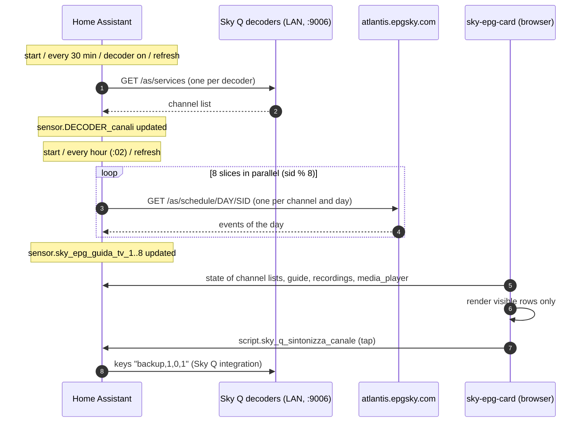

# Architecture

This document explains how the Sky Q TV Guide works internally: where the data comes
from, how it is stored in Home Assistant, how the card renders it and why some design
choices were made. You do not need it to install or use the project.

- [Design goals](#design-goals)
- [Data flow](#data-flow)
- [Channel lists](#channel-lists)
- [The schedule (guide)](#the-schedule-guide)
- [Recordings](#recordings)
- [Tuning and playback](#tuning-and-playback)
- [The card](#the-card)
- [Performance](#performance)
- [Files and responsibilities](#files-and-responsibilities)

## Design goals

1. **Everything inside Home Assistant.** No add-on, container, cloud service or
   external server: only YAML packages, Jinja macros and a JavaScript card.
2. **The guide matches the decoder.** The channels shown are exactly those stored on
   each decoder, in the decoder's numbering, including digital terrestrial (5000+)
   and free satellite channels. When the decoder is re-tuned, the guide follows.
3. **Official data.** The schedule comes from the same Sky service the decoders use.
4. **Fast on phones**, even with 1,100+ channels and a 24-hour schedule.
5. **Resilient.** If a decoder or the schedule service does not answer, the last valid
   data is kept.

## Data flow



## Channel lists

Each decoder has a **trigger-based template sensor** defined in
`packages/sky_epg_decoders.yaml`. On every trigger it calls
`rest_command.sky_epg_lista_canali` (`GET http://<ip>:9006/as/services`) and stores a
compact version of the answer:

- **state**: number of channels;
- **`canali`**: list of strings `"number|name|service type|format|sid"`, for example
  `"101|Rai 1 HD|DSAT|hd|899"`;
- **`media_player`**, **`host`**, **`registrazioni`**: the configuration of the block,
  so that the rest of the system (and the card) can find the sensor of a decoder and
  the decoder with the hard disk without any other configuration;
- **`raggiungibile`**: whether the last read succeeded; **`aggiornato`**: time of the
  last successful read.

Service types: `DSAT` (Sky satellite channels, about 250), `DTT-SWAPPED` (a few
channels with a Sky number and a Sky id that the decoder receives from digital
terrestrial, e.g. 227 Rai Sport), `DTT` (digital terrestrial, 5000+, about 350), `OFTA`
(free satellite channels, 9000+, about 500). Format: `sd`, `hd`, `uhd`, `au` (radio).

Triggers: Home Assistant start, every 30 minutes, the decoder turning on (from `off` or
`standby`) and the `sky_epg_aggiorna_canali` event (refresh button,
`script.sky_q_aggiorna_lista_canali`). A condition skips the request while the Sky Q
integration reports the decoder as `unavailable`: Sky Q boxes go into deep standby for a
few hours every night and do not answer on port 9006, so the request could only fail.
Waking up from deep standby (`unavailable` → `off`) is deliberately not a trigger: right
after it the decoder answers `503` for a while; the next 30-minute refresh reads the list.
If the decoder does not answer, or answers with an empty list, the previous value is kept
(macros `sky_epg_numero`, `sky_epg_canali`).

The compact string format keeps the attribute small (about 50 KB for 1,100 channels)
and fast to parse in the browser.

## The schedule (guide)

### Which channels

The macro `sky_epg_sids()` collects the Sky channel ids (`sid`) of all the channel
list sensors (every sensor with the attributes `canali` and `media_player`), keeping
only `DSAT` and `DTT-SWAPPED` channels that are not radio: about 200 channels for a
typical Sky Italia subscription. Digital terrestrial and free channels are not known
to the Sky EPG service; the card shows for them the schedule of the Sky channel with
the same (normalized) name, or the one chosen with the `alias` option.

### Download

The Sky EPG service returns the schedule of **one channel for one day** per request
(`GET http://atlantis.epgsky.com/as/schedule/YYYYMMDD/SID`; requests for several
channels are rejected). A 24-hour window needs one or two days per channel, so a full
refresh is 200–400 requests.

Home Assistant template results are rendered to text and parsed again on every
step, so accumulating a large dictionary inside a single script loop gets slower and
slower (quadratic). The download is therefore split into **8 slices** (`sid % 8`):

- `script.sky_epg_scarica_guida` downloads one slice (fields `parte`, `parti`, `ore`)
  and returns `{guida: {sid: [events]}, ore: N}` as its response (`stop` with
  `response_variable`);
- 8 trigger-based template sensors `sensor.sky_epg_guida_tv_1..8` call the script in
  parallel (one slice each) and store the result in their `guida` attribute.

A full refresh takes about 5 seconds. Triggers: start, every hour at minute 2, and the
`sky_epg_aggiorna_canali` event. The window is `now` → `now + ore + 1 hour`.

### Event format

Each event is a compact list (macro `sky_epg_eventi`):

```text
[start (epoch s), duration (s), title, short description (max 100 chars), event id, flags]
```

- **event id** (`eid`, e.g. `E383-116`) is the id used to book a recording;
- **flags**: `1` = the programme can be recorded, `2` = it can be recorded as a series
  (from the `canb` / `canl` fields of the service).

The `guida` attributes are 60–120 KB each, which is why the sensors are excluded from
the recorder (`recorder: exclude:` in `sky_epg.yaml`): the recorder refuses
attributes larger than 16 KB anyway, and the history of a schedule is useless.

### Full description

The guide keeps only the first 100 characters of each description: the attributes
reach every open dashboard on every refresh, and with the full text they would grow by
about half (from about 660 KB to about 1 MB in total). Sky itself sends at most about
230 characters (longer synopses end with "...").

When the menu of a programme is opened and its description is 100 characters long,
the card calls `script.sky_epg_descrizione` (fields `sid`, `eid`, `inizio`) with
`return_response`. The script downloads the day of that channel again
(`rest_command.sky_epg_palinsesto`, then the day before if the programme starts after
midnight and is not found), finds the event by id with the macro
`sky_epg_descrizione` and returns `{descrizione: "…"}`. The card shows the short text
followed by "…" until the answer arrives, keeps the last 200 descriptions in memory,
and keeps the short text if the script is missing (backend not updated) or fails.

## Recordings

`packages/sky_epg_registrazioni.yaml` is optional. It uses the decoder whose channel
list sensor has `registrazioni: true` (macro `sky_epg_host_registrazioni()`), i.e. the
main box with the hard disk. Sky Q Mini boxes have no disk: their recordings are those
of the main box.

- `sensor.sky_q_registrazioni` reads `GET /as/pvr/?limit=1000&offset=0` and
  `GET /as/pvr/storage` every 10 minutes and on the events `sky_epg_aggiorna_registrazioni`
  / `sky_epg_aggiorna_canali`. It keeps the **scheduled and in-progress** recordings
  as `[pvrid, eid, start, duration, title, channel, series linked, status, series id]`
  and the disk usage in percent. A trigger condition keeps it idle while no decoder
  has `registrazioni: true` and while the Sky Q integration reports that decoder as
  `unavailable` (deep standby).
- `script.sky_q_registrazione` performs the actions with `POST` requests:

  | `azione` | Request |
  | --- | --- |
  | `registra` | `pvr/action/bookrecording?eid=<eid>` |
  | `registra_serie` | `pvr/action/bookseriesrecording?eid=<eid>` |
  | `annulla` | `pvr/action/delete?pvrid=<pvrid>` |
  | `annulla_serie` | `pvr/action/seriesunlink?pvrid=<pvrid>`, then `delete` of every scheduled episode of the same series |

  The decoder answers `200` when the action is accepted; otherwise the script stops
  with an error, which the card shows. At the end the script fires
  `sky_epg_aggiorna_registrazioni`, so the red dots update right away.

## Tuning and playback

- **Tuning** (`script.sky_q_sintonizza_canale`): turns the decoder on if it is `off`
  or `standby` (then waits 4 s), then calls `media_player.play_media` with
  `media_content_type: skyq` and `media_content_id: "backup,1,0,1"` (the Sky Q
  integration sends these remote keys). The Sky Q integration polls the decoder every
  10 s, so the script then calls `homeassistant.update_entity` every 1.5 s (at most 6
  times) until the `skyq_channelno` attribute reports the new channel.
- **Playback**: the card calls the standard `media_player` services, which the Sky Q
  integration maps to the remote keys: `media_previous_track` → *rewind*,
  `media_next_track` → *fast forward*, `media_play` → *play*, `media_pause` → *pause*.

## The card

`sky-epg-card` is a vanilla Web Component (no build step, no dependencies besides the
EPG Card). It does not draw the guide rows itself: it creates instances of the EPG
Card (`<epg-card>`), feeds them **fake `hass` objects** with one "entity" per channel
in the format the EPG Card expects (`today` / `tomorrow` dictionaries of programmes),
and then decorates the rendered DOM (current channel, logos, booked programmes,
event handlers).

Main pieces:

- **Channel model**: parsed from the `canali` attribute; categories (Sky, digital
  terrestrial, free satellite, radio); name normalization (`skyEpgKey1/2`) to pair
  digital terrestrial / free channels with their Sky twin (guide and logo), with a few
  built-in aliases and the `alias` option.
- **Guide model**: the `guida` attributes of all `sensor.sky_epg_guida_tv*` sensors
  merged once per change.
- **Optimistic UI**: after a tap the chosen channel is highlighted immediately and the
  header shows *Tuning…* until the decoder confirms (or 30 s pass); bookings show their
  red dot immediately and are confirmed when the recordings sensor reports them (or
  reverted on error); play / pause flips its icon immediately.
- **Logos**: Sky logo images are very wide with the logo in a corner; they are loaded
  with CORS, cropped on a canvas to the visible pixels and cached as blob URLs. With a
  light theme they get a dark rounded background (the logos are white).
- **Long press**: pointer events with a 550 ms timer; the click that follows the
  release is swallowed so it does not tune the channel; right-click works on desktop.
- **i18n**: Italian and English strings, chosen from the Home Assistant language or
  the `language` option.
- **Visual editor**: `getConfigForm()` returns a schema for Home Assistant's built-in
  form editor.

## Performance

A naive guide with 1,100 channels × 24 hours creates tens of thousands of DOM nodes
and is very slow to scroll on phones. The card uses **virtualization**:

- the channels are split into blocks of 20 rows; each block is one `<epg-card>`;
- only the blocks near the visible area exist in the DOM (the others are created and
  removed while scrolling, at most once per animation frame);
- one single scroll container (vertical and horizontal) with a sticky time bar copied
  from the first block, and a hidden "anchor" row in every block so that all blocks
  share the same horizontal time scale;
- the styles are shared through `adoptedStyleSheets` (with a fallback for old iOS);
- the guide is re-rendered at most once a minute (aligned to the minute) or when the
  data change, never on every Home Assistant state change.

On the Home Assistant side, the 8 parallel slices keep the hourly refresh at a few
seconds of work, and the large attributes are excluded from the recorder.

## Files and responsibilities

| File | Contents |
| --- | --- |
| `homeassistant/packages/sky_epg.yaml` | `rest_command.sky_epg_lista_canali`, `rest_command.sky_epg_palinsesto`, recorder exclusions, `script.sky_epg_scarica_guida`, `script.sky_epg_descrizione`, `script.sky_q_sintonizza_canale`, `script.sky_q_aggiorna_lista_canali`, `sensor.sky_epg_guida_tv_1..8`. |
| `homeassistant/packages/sky_epg_decoders.yaml` | One channel list sensor per decoder (user configuration). |
| `homeassistant/packages/sky_epg_registrazioni.yaml` | `rest_command.sky_epg_decoder_leggi`, `rest_command.sky_epg_decoder_azione`, `script.sky_q_registrazione`, `sensor.sky_q_registrazioni`. |
| `homeassistant/packages_include_dir_named/` | The same three packages for `packages: !include_dir_named` (package name = file name, no first line). Generated by `tools/make_include_dir_named.py`: never edit them by hand. |
| `tools/make_include_dir_named.py` | Rebuilds `packages_include_dir_named/` from `packages/` (`--check` only verifies it, as the CI workflow does). |
| `homeassistant/custom_templates/sky_epg.jinja` | Macros: `sky_epg_valida`, `sky_epg_numero`, `sky_epg_canali`, `sky_epg_aggiornato`, `sky_epg_sids`, `sky_epg_eventi`, `sky_epg_host_registrazioni`, `sky_epg_programmate`, `sky_epg_pvr_valida`. |
| `dist/sky-epg-card.js` | The card. |
